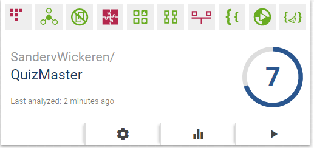

# Task list
Write Short Units of Code:
  — registerClick.​onClick(View)
      starts at line 50 in app/​src/​main/​java/​com/​sandervwickeren/​quizmaster/​Registerfragment.​java
  — Scorefragment.​getScores(Integer)
      starts at line 122 in app/​src/​main/​java/​com/​sandervwickeren/​quizmaster/​Scorefragment.​java

# Screenshot

