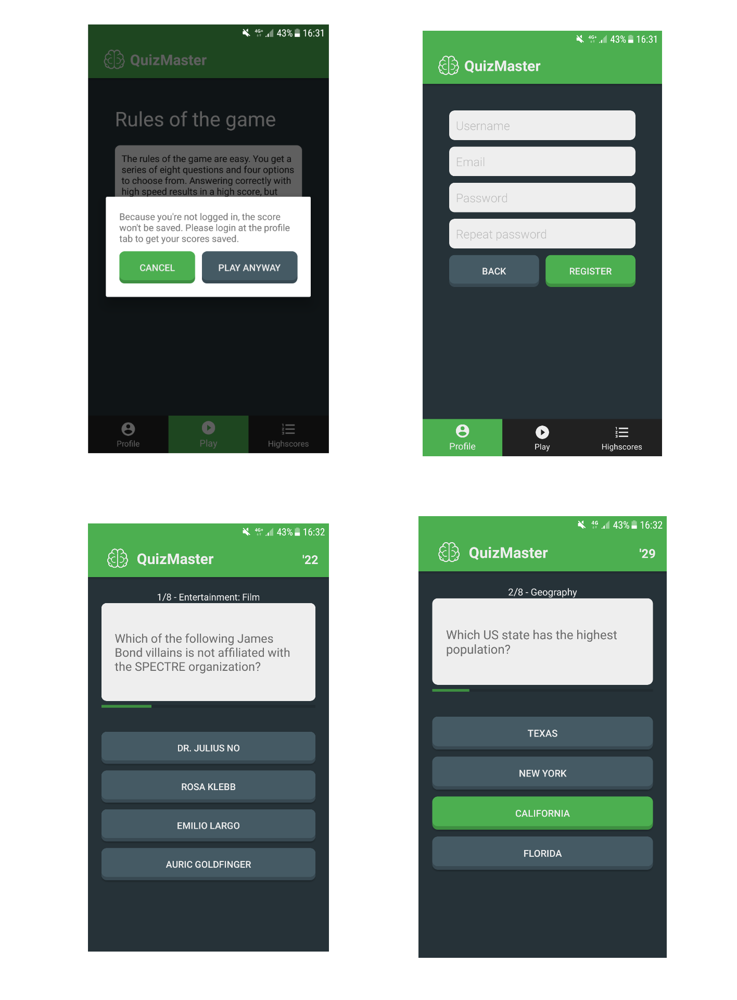
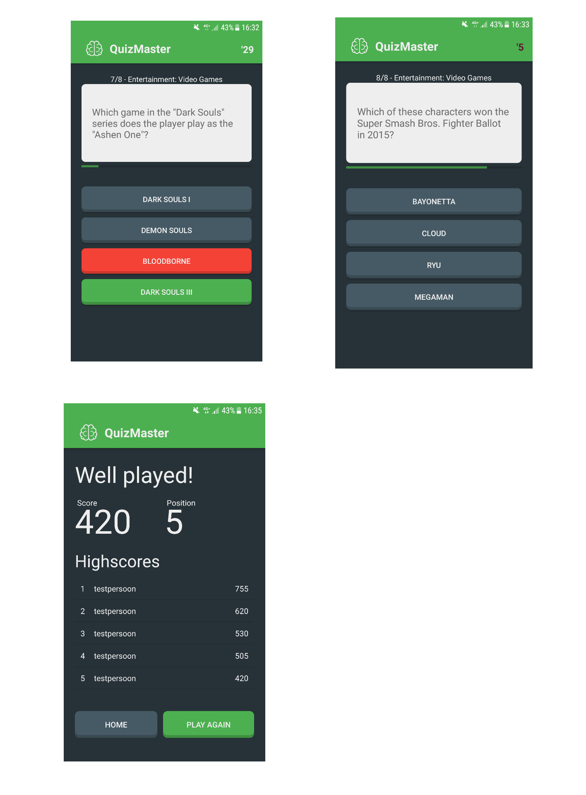

# QuizMaster
Dit is een applicatie gemaakt in de slotweek van het vak "Native App studio". Deze app is een soort quiz waar je tegen andere kan strijden om een toppositie te bemachtigen in de leaderboards. Belangrijk hierbij is dat er een tijdslimiet aan hangt en er door middel van de [openTrivia database](https://opentdb.com/) willekeurige vragen aan de gebruiker worden voorgeschoteld. Des te sneller je juist beantwoort, des te hoger de score. Maar gok je snel fout, levert het extra veel minpunten op. De gebruiker moet ingelogd zijn om een score te kunnen plaatsen, maar kan zonder ingelogd te zijn wel spelen / highscores bekijken. De gebruiker krijgt hierover een popup mededeling voor het spelen, en daarnaast wordt de inlogstatus visueel getoond doordat de kleur van de button groen is wanneer iemand is ingelogd, en anders donkergrijs.

# Technische Details
- Maakt gebruik van Volley
- Maakt gebruik van Fragments en twee activities
- Maakt gebruik van Firebase

# Afbeeldingen

